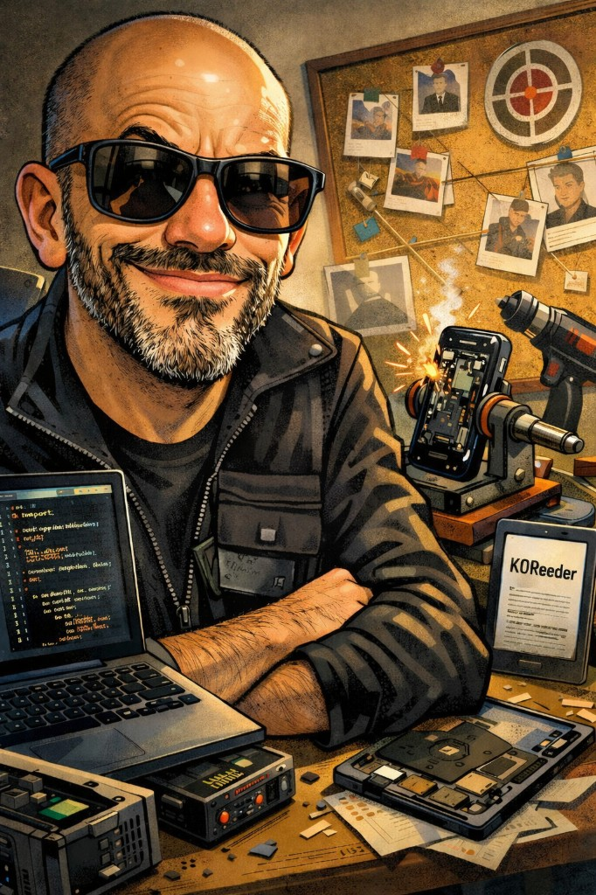

<div align="center">

# Kapitostes

**Maker · Android head units · retro computing**



</div>

## Sobre mí

```yaml
name: Kapitostes
github: kapi21
location: Badajoz, Spain
focus: [radios Android, retrocomputing, herramientas pequeñas]
stack: Python · Java · JavaScript · Android
now: OpenRadioFM · SINTAXIA
```

- Trabajo sobre hardware real: radios Android de coche (MT8163, K706 y similares) y máquinas retro.
- Me interesa que el software encaje con el aparato, no al revés.
- Publico lo que tiene sentido compartir; el resto se queda en repos privados.

## Proyectos

- **[OpenRadioFM](https://github.com/kapi21/OpenRadioFM)** — Mods y herramientas para radios Android (MT8163, K706, MTK8259, QS NWD).
- **[SINTAXIA](https://github.com/kapi21/SINTAXIA)** — Motor de aventura de texto con IA para Amstrad CPC.
- **[GORILAPP](https://github.com/kapi21/GORILAPP)** — Tracker de entreno en el gym.
- **[Open_VHS](https://github.com/kapi21/Open_VHS)** — Vídeo moderno a estética VHS de los 80, pensado para Trinitron 4:3.

## Stack


## Actividad


## Contacto

[github.com/kapi21](https://github.com/kapi21)
